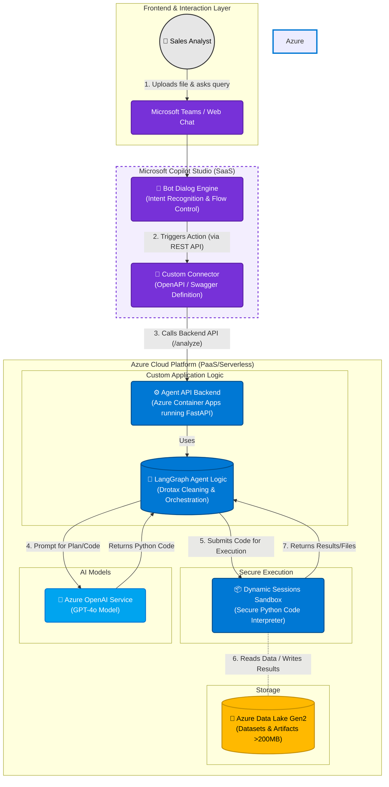

# Sales Data Analytic Agent
> An enterprise-grade Sales Analysis Agent built on Microsoft Azure that orchestrates the ingestion of large-scale datasets and executes asynchronous Python workflows to automate data cleaning, normalization, and competitor matching.


## 📖 Introduction
**Why this project exists:**
Sales analysts are currently bottlenecked by the inability of standard AI tools to process large, messy datasets (>200MB), forcing them to manually clean data and painstakingly match thousands of ambiguous competitor product descriptions to internal hierarchies.

## 🚀 Demo / Screenshots


## 🛠️ Technical Architecture

### Tech Stack
| Architecture Layer | Technology | Key Purpose | Pricing Model |
| :--- | :--- | :--- | :--- |
| **Frontend & Orchestration** | **Microsoft Copilot Studio** | Provides the chat interface (UI), manages conversation history, and handles intent recognition. Native integration with MS Teams. | Monthly License (Tenant) + Billed per Message/Interaction |
| **Intelligence Engine** | **Azure OpenAI Service** | Provides the LLM (GPT-4o or GPT-4-Turbo) for code generation, semantic reasoning, and complex data analysis planning. | Pay-as-you-go (Per Input/Output Token) |
| **Backend API Framework** | **Python (FastAPI)** | The application logic layer. Exposes REST endpoints that Copilot Studio calls as "Plugins". Handles file I/O and orchestration logic. | Open Source (Hosting costs apply) |
| **Compute & Hosting** | **Azure Container Apps** | Serverless container platform to host the FastAPI backend. Scales to zero when unused to save costs. | Consumption-based (vCPU/Memory seconds) |
| **Secure Code Execution** | **Azure Container Apps Dynamic Sessions** | A secure, sandboxed "Code Interpreter" environment to run generated Python code safely without risking the host server. | Pay-as-you-go (Per Session Hour) |
| **Data Storage** | **Azure Data Lake Storage Gen2 (ADLS)** | Stores large uploaded datasets (>200MB) and persists analysis artifacts (cleaned CSVs, plots). | Pay-as-you-go (Storage capacity + Read/Write operations) |
| **Agent Logic Framework** | **LangGraph / LangChain** | Python libraries to manage the agent's internal state machine, specifically for complex loops like the Drotax data cleaning workflow. | Open Source |

### System Design

## 💡 Key Challenges & Solutions (The "STAR" Method)
### Challenge 1: [Name of the Challenge, e.g., Reducing Latency in LLM Response]
* **Situation:** The initial response time was over 10 seconds, which was poor UX.
* **Task:** Reduce latency to under 2 seconds.
* **Action:** Implemented semantic caching (Redis) and switched to a quantized model format (GGUF).
* **Result:** Reduced average latency by 80% without significant loss in accuracy.

### Challenge 2: [e.g., Handling Concurrent Users]
* **Situation:** ...
* **Action:** ...
* **Result:** ...

## 💻 How to Run
```bash
# Clone the repository
git clone [https://github.com/your-username/project-name.git](https://github.com/your-username/project-name.git)

# Run with Docker
docker-compose up --build
