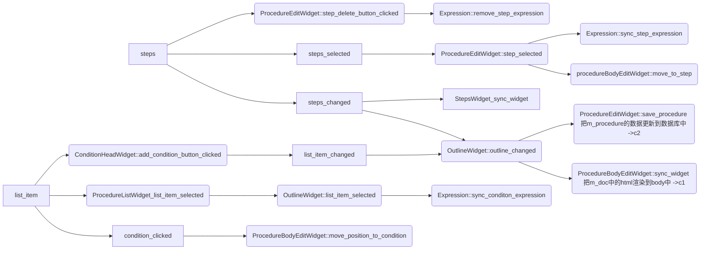

# introduction


# Situation
龙鳍®NicSys®2000高温堆HMI功能支持软件是一体化组态工具的一部分，主要用于为HMI功能所需的内容提供由用户进行配置的界面。

2000-HTGR-HMI project  is one part of CONFIG, the main purpose is to provide GUI for function that HMI need for uesr to config  
> HTGR: high-temperature gas-cooled reactor

# Task
通过规程离线组态功能实现对规程的离线组态相关操作，包括规程的新建、修改、逻辑组态、导入、导出、下装等功能项。

To implement the operation for procedure by procedure offline config , inlude create, update, config, import, export, deployment, and etc.


# Action
使用Qt开发一个插件
imporment a pugin by Qt framework
## trouble shooting
- 槽函数重复执行
    - 重复connect导致
        - 设置uniqueconnection
        - connect在constractor这种地方而不是重复执行的function
    - 设置debounce
    - slot function中设置condtion, 保证特定的状态下这个slot function只执行一次
- slot执行顺序错误
   - 都和parentocnnect
   - connect signal and signal
# Result

实现了规程的新建、修改、逻辑组态、导入、导出、下装等功能项


# useful command
```
D:\NicBuilder\CONFIG\src\plugins\nic.config.cx.procedure> C:\Qt\5.15.2\msvc2019_64\bin\lupdate.exe . -ts zh_CN.ts

C:\Qt\5.15.2\msvc2019_64\bin\linguist zh_CN.ts

C:\Qt\5.15.2\msvc2019_64\bin\lrelease zh_CN.ts

powershell.exe Get-Content D:\debug.log -Wait


Compare-Object (Get-Content main.cpp) (Get-Content maincopy.cpp)


git update-index --no-assume-unchanged CONFIG.pro
git update-index --assume-unchanged CONFIG.pro

```

# signal and slot relationship





